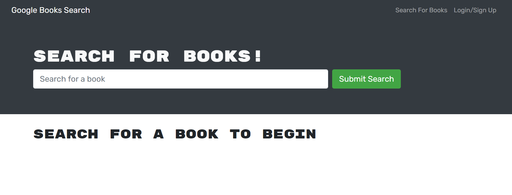

# Book Search Engine 

## Table of Contents
* [Description](#description)
* [Installation](#installation)
* [Usage](#usage)
* [Contributing](#contributing)
* [Tests](#tests)
* [License](#license)
* [Questions](#questions)

## Description <a name="description"></a>
This is a Google Books Search Engine that utilizes a GraphQL API.  The starter code that was provided was a fully functional application that was built with a RESTful API.  The intent of this exercise was to refactor the code and convert the RESTful API to a GraphQL API.  The GraphQL API uses Apollo for the server and provider.  Refactoring tasks included implementing the Apollo Server, updating the authentication middleware function to work with the GraphQL API, creating the Schema (including typeDefs and resolvers), creating the front-end provider files to the GraphQL queries and mutations, and revising the methods for executing the queries and mutations.

## Installation <a name="installation"></a>
To edit/improve the code of the application, please do the following: 

1. Clone the application's respository from GitHub onto your local drive.  The GitHub URL is: https://github.com/plainjane99/book-search.

2. Set up the ```npm``` package by running the following command in the root directory, the client directory, and the server directory of the application: 
    
    ```
    npm install
    ```
    
    This will download the application's dependencies into the respective directories.
3. A ```.gitignore``` file should be created to include:
    ```
    node_modules
    .env
    .DS_Store
    ```
    if you intend to push your code to a repository.

## Usage <a name="usage"></a>

1. a.  Once code installation is complete, run the application by typing the following into the command line at the root directory of the application:

    ```
    npm start
    ```
    
The server will start and open your browser to the application page at http://localhost:3000/.    

1. b. The live version of the application is located at:  https://warm-refuge-78398.herokuapp.com/

2. The application should look like the following:



Functionality includes sign-up, log-in, book search, adding books to a "See Your Books" page, deleting books from the "See Your Books" page, and logging out.    

## Contributing <a name="contributing"></a>
Contributions are welcome.  

The only known issue is deleting a book does not refresh the list of saved books; the page must be manually refreshed for the book to disappear.  

Please contact me regarding other improvements, questions, or comments you would like to make.

## Tests <a name="tests"></a>
This application uses Playground for query/mutation testing.  Playground can be accessed at http://localhost:3001/graphql when the server is running.

## License <a name="license"></a>
This application is covered under the MIT license.

## Questions <a name="questions"></a>
My GitHub username is ```plainjane99```.  Please feel free to peruse my other projects.

If you have any questions regarding this application, please contact me via email at ```jane99hsu@gmail.com```.
  